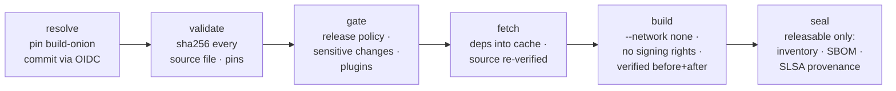

# 🧅 build-onion

**A build protector for CI/CD.** build-onion runs your build as a protected, fully inventoried build line, and gives you a verifier that peels any artifact back to the exact commit, pipeline and inputs that produced it.

It targets the class of attacks where the **build pipeline itself** is the weak point:

- **Compromised build environments:** clean source goes in, a modified artifact comes out.
- **Mutable pipeline dependencies:** an action tag or image tag repointed to malicious code runs inside every pipeline that references it.
- **Everyday mistakes:** an unpinned tool, a build that quietly reaches the internet, a release cut from a branch nobody reviewed.

build-onion is **not a scanner** and doesn't try to replace your SCA, SAST or secret-scanning tools. It protects the build and records what happened in it. Those tools plug in through a [small, language-agnostic plugin API](docs/plugins.md), and their verdicts land in the same signed record.

build-onion builds, signs and verifies **itself** with this pipeline.

## The question it answers

> Was this exact artifact built from **this commit**, whose files hashed to **exactly these bytes**, by **this pipeline** (every action and tool pinned and recorded), from **these declared inputs**, after a **gate** allowed it, and nothing else?

## How a build runs

A manifest (`build-onion.yml`) declares everything the build may use. Anything undeclared is refused.



| Layer | Protection |
|---|---|
| **Source** | Every tracked file is hashed with sha256 before anything runs. The fetch and build jobs re-verify every byte before and after each step, and any new file outside the declared outputs fails the build. `.gitignore` can't hide a planted file. |
| **Toolchain** | The builder image and every `FROM` must be pinned by digest, and every action by commit SHA, or the build fails. |
| **Gate** | Release refs and events come from policy. Pull requests, feature branches and forks build but are never sealed. `pull_request_target` is refused outright. Changes to workflows, the manifest, lockfiles, the Dockerfile or the policy are flagged. Gate plugins (such as a commit-risk model) are advisory or enforcing. |
| **Dependencies** | Fetched in their own job and verified against the lockfile. The build sees only that cache. |
| **Build** | Runs in the pinned builder with `--network none`, in a job that has **no permission to sign**. |
| **Pipeline** | The inventory records the build-onion commit and CLI digest, every workflow with every action it pins, and each job's runner image and tool versions. "Which builds ran X?" becomes a query. |
| **Seal** | A job that never runs caller code re-hashes the outputs and signs SLSA v1 provenance, a CycloneDX SBOM of what was actually built, and the inventory. |

### Why it's SLSA Build Level 3

| Requirement | How |
|---|---|
| Hosted build platform | GitHub-hosted runners. `peel` rejects provenance from any other `runner_environment`. |
| Unforgeable provenance | Signing happens only in `seal`, which never executes caller code. The certificate identity is the **build-onion reusable workflow**, which a caller cannot impersonate. |
| Isolated builds | Fresh VMs per job. The build job can't request a signing token, and nothing it *reports* is trusted: outputs are re-hashed. |

## Peeling an artifact

```console
$ onion peel ghcr.io/pattercj/build-onion@sha256:… --repo PatterCJ/build-onion --commit 3f9c… --source .
```

| Layer | Checks |
|---|---|
| **seal** | Every Sigstore bundle verifies; the signer is build-onion; the certificate's repo and commit match the claim; one run signed provenance, SBOM and inventory. |
| **provenance** | SLSA v1, the builder is build-onion, a hosted runner, and the repo and commit match. |
| **inventory** | Same commit and run; the artifact is a declared output; the builder is pinned; the build had no network; inputs are locked. |
| **gate** | The gate allowed release. Sensitive changes and advisory plugin findings are shown as warnings. |
| **pipeline** | The builder commit is recorded, every action is pinned, and job toolchains are recorded. |
| **dependencies** | Every Go module found *inside the artifact* is in the lockfile. |
| **source** *(`--source`)* | Every file in the checkout hashes to the signed snapshot; the tree, manifest and lockfiles match. |
| **rebuild** *(`--rebuild`)* | Replaying the manifest gives the same bytes. |

The result is PASS/WARN/FAIL per check, with a non-zero exit on any FAIL. Add `--json` to feed a deploy gate. Bundles come from the GitHub attestations API, or from `--bundles DIR` for offline and air-gapped verification.

## Adopt it

```yaml
# .github/workflows/release.yml
jobs:
  build:
    permissions: { contents: read, id-token: write, attestations: write, packages: write }
    uses: PatterCJ/build-onion/.github/workflows/onion-build.yml@<commit-sha>
    with:
      policy: .build-onion/policy.yml   # optional
```

- [Adopting](docs/adopting.md): writing the manifest, other ecosystems, reproducibility.
- [Policy](docs/policy.md): release rules, sensitive paths, making policy mandatory across an org.
- [Plugins](docs/plugins.md): the JSON-over-stdio API for bringing your own tools.
- [Threat model](docs/threat-model.md): exactly what this does and doesn't stop.

## Portability

The `onion` CLI takes everything as flags and knows nothing about GitHub. The GitHub Actions workflow is the first integration: it supplies events, refs, and Sigstore signing through GitHub's attestations. The same commands (`source`, `gate`, `fetch`, `build`, `record`, `inventory`, `peel`) are the building blocks for other CI systems and cloud build services such as AWS CodeBuild.

## Roadmap

- [x] **Phase A:** per-file source snapshot, pipeline inventory, gate with plugin API
- [ ] **Phase B:** separate the build, security and publish lines. The security line re-verifies the source, runs `scan` plugins, and independently rebuilds from the same hashed inputs; that rebuild catches a file swapped during compilation and restored afterward. The publish line gates on `onion peel`.
- [ ] **Phase C:** no internet in the build line. Fetch goes through an allow-list egress proxy to a configured artifact store (Artifactory, Nexus, GitHub Packages, …), and blocked attempts are recorded.
- [ ] **Phase D:** reference gate plugin for commit-risk scoring; `onion audit-repo` for insecure GitHub settings (branch/tag protection, token defaults, fork approval).

## Development

```sh
make test        # go vet + go test
make validate    # onion validate on this repo
```

The Sigstore tests verify a real GitHub Actions–signed bundle offline, and the plugin tests exercise the full protocol with script plugins.

## License

MIT
