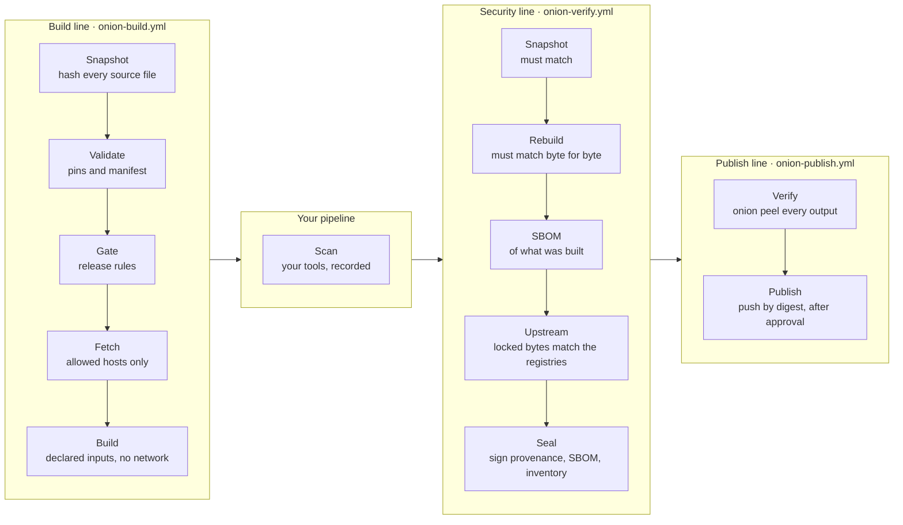

# 🧅 build-onion

**A build protector for CI/CD.** build-onion runs your build from a declared manifest, reproduces it independently before anything is signed, and seals a signed record of everything that went into it. `onion peel` verifies any artifact against that record, down to every package inside it.

## What you provide, what you get

| You provide | You get |
|---|---|
| `build-onion.yml`: the builder image, lockfile, fetch and build commands, the files the build may read, and the outputs | Artifacts built with no network, from only the declared files and dependencies |
| A lockfile for your dependencies | Every package inside the artifact proven against that lockfile, and every locked package checked against its public registry and signed provenance |
| A workflow that calls build-onion's three reusable workflows | A build reproduced byte for byte on separate runners before it's signed |
| *Optional:* a policy, allowed fetch hosts, your own scan jobs | SLSA Build Level 3 provenance, an SBOM and an inventory, signed and attached to each artifact |
| | Images published by digest, only after `onion peel` verifies them (and, given the last release, compares with it) and a reviewer approves |
| | `onion peel`: a graded, per-check verdict any deploy gate can act on |

Works for any language whose build runs in a container. Lockfile checks cover Go, npm, Python and Rust. build-onion builds, verifies and publishes itself with this pipeline, and [build-onion-example-python](https://github.com/PatterCJ/build-onion-example-python) shows a complete Python service.

## What a verified artifact means

When `onion peel` passes, every statement below was checked:

- The artifact's digest is signed by build-onion's security line, for the repository and commit it claims.
- It was built from that commit's files, each one hashed, and the build could read only its declared inputs (`build.inputs`, or every tracked file when none are declared).
- Its dependencies came only from the lockfile, fetched only from the allowed hosts, and every package found inside it is accounted for by the lockfile or by the pinned base image.
- Every locked package that is on its public registry has the bytes that registry publishes (for Go, the bytes in the checksum log), and any provenance the registry serves for them verifies.
- The build ran in a builder image pinned by digest, with no network; every workflow action was pinned to a commit, and the runner images and tool versions were recorded.
- A second build on separate runners produced the same bytes before it was signed.
- The release rules allowed it, and every recorded scan examined these exact bytes.
- *With `--trust`:* it was sealed by a build-onion release on your own trust list, one whose tag was signed by a key you listed and which your previously trusted `onion` verified.

## How it works

Three reusable workflows, each allowed to do only its own part:



| Line | Can | Cannot |
|---|---|---|
| **Build** | Build in the pinned builder image with no network, and stage the outputs. | Sign anything. |
| **Security** | Rebuild on its own runners and sign, only when its bytes match the build line's. | Run anything but build-onion's own code in the job that signs. |
| **Publish** | Push exactly the sealed digest, in a GitHub environment that can require approval. | Sign anything, or publish anything `onion peel` doesn't verify. |

Each line builds its own `onion` CLI from the build-onion commit it runs at.

### What each step enforces

| Step | Enforces |
|---|---|
| **Snapshot** | Every tracked file is hashed with sha256. Fetch and build run on a copy containing only the declared `build.inputs`, re-checked after each step. A new file outside the declared outputs fails the build. |
| **Validate** | The builder image and every `FROM` are pinned by digest, and every action by commit SHA. |
| **Gate** | Only release refs and events are sealed; pull requests, other branches and forks build but aren't signed. `pull_request_target` and `workflow_run` are refused. Changes to build configuration, and binary files the build can read, are recorded. |
| **Fetch** | Dependencies are fetched in their own step and checked against the lockfile. With `dependencies.egress`, the only route out is a proxy that allows the listed hosts, and every connection is recorded. |
| **Build** | Runs in the pinned builder with no network, reading only the staged inputs and the fetched dependencies. |
| **Rebuild** | The security line repeats fetch and build on its own runners; sealing requires identical bytes. |
| **Upstream** | Every locked package is checked against its public registry: Go against the checksum log, npm and Python against the registry's files and their signed provenance, Rust against the crates.io index. |
| **Seal** | Signs SLSA v1 provenance, a CycloneDX SBOM of the built artifact, and the inventory: source, inputs, dependencies, upstream checks, pipeline, gate, fetch connections, rebuild and scans. |

### SLSA Build Level 3

| Requirement | How build-onion meets it |
|---|---|
| Hosted build platform | GitHub-hosted runners; `peel` rejects provenance from any other runner environment. |
| Unforgeable provenance | Only the security line's seal job signs, and it never runs your build's code. Its signing identity is `onion-verify.yml`. |
| Isolated builds | Every job is a fresh VM, and the security line rebuilds rather than trusting what the build line reports. |

## Verifying an artifact

```console
$ onion peel ghcr.io/acme/widget@sha256:… --repo acme/widget --ref 'refs/heads/main,refs/tags/v*'
```

### Arguments

| Argument | Meaning |
|---|---|
| `ARTIFACT` | A file, an image reference (a tag is resolved to its digest once), or an OCI tarball with `--oci`. |
| `--repo OWNER/REPO` | The repository the artifact claims to come from. Required. |
| `--commit SHA` | Require a specific commit. |
| `--ref REFS` | Require the source ref to match one of these globs. |
| `--source DIR` | Also check a local checkout against the signed snapshot. |
| `--rebuild` | Also rebuild locally from `--source` and compare (needs Docker). |
| `--trust FILE` | Accept only artifacts sealed by a build-onion release on this list (see [Adopting](docs/adopting.md#6-trust-build-onion-releases-not-commits)). |
| `--baseline ARTIFACT` | Also verify a previous release and report what changed since it. |
| `--packages` | List every package found in the artifact, its outcome, and its upstream outcome. |
| `--bundles DIR` | Verify offline from saved bundles instead of the GitHub attestations API. |
| `--json` | Print the full report as JSON. |
| `--allow-degraded` | Exit 0 when the only problems are coverage gaps. |

Set `GITHUB_TOKEN` when verifying often: unauthenticated GitHub API requests are limited to 60 an hour.

### Report sections

| Section | What's checked |
|---|---|
| **seal** | Every bundle's signature, the signer, the repository and commit in the certificate, that one run and one build-onion commit signed provenance, SBOM and inventory, and with `--trust` that the commit is a trusted release. |
| **provenance** | The builder, a hosted runner, the source repository and commit, and with `--ref` the source ref. |
| **inventory** | Same commit and run as the provenance, the artifact is a declared output, the builder is pinned, the build had no network, and which files the build could read. |
| **gate** | The release rules allowed it; build-configuration and binary changes are listed as notes. |
| **egress** | Every connection fetch made was to an allowed host. |
| **verification** | The independent rebuild produced this exact digest. |
| **pipeline** | The build-onion commit, every action pinned, and each job's runner and tools recorded. |
| **scans** | Each recorded scan examined this build and completed. |
| **dependencies** | Every package inside the artifact is accounted for: declared in the lockfile at the same version (and the same content hash where both carry one), from the pinned base image's layers, or bundled inside a declared package. |
| **upstream** | Every locked package's bytes are what its public registry publishes, and its provenance, where published, verifies. Private packages are listed as notes. |
| **differential** | *With `--baseline`:* what changed since the previous release. A dependency that lost its provenance, or is now built by a different repository or workflow, is a finding; other changes are notes. |
| **source** | *With `--source`:* every file in the checkout matches the signed snapshot. |
| **rebuild** | *With `--rebuild`:* a local rebuild produces the same bytes. |

### Results

Each check is graded, and the verdict is the worst grade present:

| Grade | Meaning | Exit code |
|---|---|---|
| **PASSED** | The check completed and the evidence satisfies it. | 0 |
| **DEGRADED** | The check ran, but coverage is incomplete. | 3 |
| **UNSUPPORTED** | An input can't be analyzed, such as an ecosystem without lockfile support. | 3 |
| **FINDING** | The check found a violation. | 4 |
| **FAILED** | The evidence is missing or unreadable. | 5 |

NOTE lines give context without affecting the verdict.

## Adopt it

- [Adopting](docs/adopting.md): the manifest, wiring the three lines, reproducible builds.
- [Scan records](docs/scans.md): recording the tools your pipeline already runs.
- [Policy](docs/policy.md): release rules, build-configuration files, and org-wide enforcement.
- [Reference](docs/reference.md): every manifest, policy and workflow option, and every CLI command and flag.

## The `onion` CLI

The CLI takes everything as flags and has no dependency on GitHub; the reusable workflows supply events, refs and Sigstore signing. Its commands (`validate`, `source`, `gate`, `fetch`, `build`, `compare`, `upstream`, `record`, `inventory`, `peel`, `trust`) can be driven from any CI system.

## Development

```sh
make test        # go vet + go test
make validate    # onion validate on this repo
```

To add a lockfile ecosystem, add a parser to `internal/lockfile` and a real-package fixture to `internal/deps/testdata/generate.sh`.

## License

MIT
