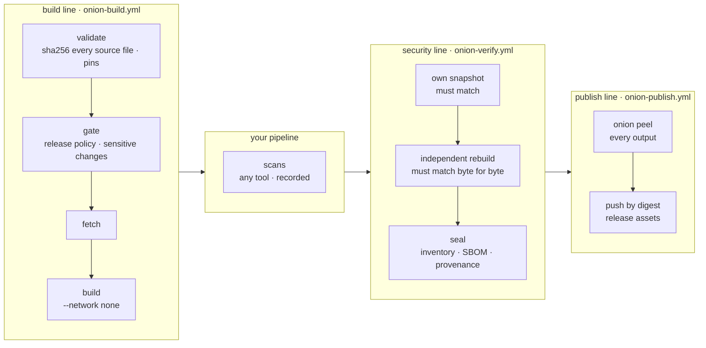

# 🧅 build-onion

**A build protector for CI/CD.** build-onion runs your build from a declared manifest as a protected, fully inventoried build line. The build is independently reproduced before anything is signed, and a verifier peels any artifact back to the exact commit, pipeline and inputs that produced it.

It targets the class of attacks where the **build pipeline itself** is the weak point:

- **Compromised build environments:** clean source goes in, a modified artifact comes out.
- **Mutable pipeline dependencies:** an action tag or image tag repointed to malicious code runs inside every pipeline that references it.
- **Self-approving builds:** the job that builds an artifact also vouches for it.
- **Everyday mistakes:** an unpinned tool, a build that quietly reaches the internet, a release cut from a branch nobody reviewed.

build-onion is **not a scanner** and doesn't judge scan results. Your pipeline runs its SCA, SAST and secret-scanning tools as it always has. build-onion [records that each one ran](docs/scans.md), when, at what stage and against exactly which bytes, in the same signed record as everything else.

build-onion builds, verifies, publishes and peels **itself** with this pipeline.

## The question it answers

> Was this exact artifact built from **this commit**, whose files hashed to **exactly these bytes**, by **this pipeline** (every action and tool pinned and recorded), from **these declared inputs**, **reproduced independently** before it was signed, and nothing else?

## Three lines, separate powers



| Line | Can | Cannot |
|---|---|---|
| **Build** | Run your build in a pinned builder with no network; stage outputs. | Sign anything. |
| **Security** | Re-snapshot the source, rebuild independently on its own runners (optionally separate infrastructure), and sign, but only if its bytes match the build line's. | Run anything but build-onion's own code in the job that signs. |
| **Publish** | Push exactly the sealed digest, behind a GitHub environment you can require approval on. | Sign anything; publish anything `onion peel` doesn't verify. |

Each line resolves and builds its own `onion` CLI from the exact build-onion commit it runs at, so no line trusts a binary another line handed it.

### What each layer protects

| Layer | Protection |
|---|---|
| **Source** | Every tracked file is sha256-hashed before anything runs, and re-verified in every job and before and after each step. New files outside declared outputs fail the build, even when `.gitignore` would hide them. |
| **Toolchain** | The builder image and every `FROM` are pinned by digest, and every action by commit SHA, or the build fails. |
| **Gate** | Only release refs and events are sealed. Pull requests, feature branches and forks build but are never signed. `pull_request_target` and `workflow_run` are refused outright. Changes to workflows, the manifest, lockfiles, the Dockerfile or the policy are flagged. |
| **Dependencies** | Fetched separately and verified against the lockfile. The build sees only that cache. |
| **Egress** | With an allow-list, fetch's only route out is a filtering proxy: undeclared hosts fail the build, metadata and loopback addresses are unreachable, and every connection is sealed into the inventory. Without one, `peel` reports fetch's network as DEGRADED. |
| **Egress** | With an allow-list, fetch's only route out is a filtering proxy: undeclared hosts fail the build, metadata and loopback addresses are unreachable, and every connection is sealed into the inventory. Without one, `peel` reports fetch's network as DEGRADED. |
| **Rebuild** | The security line reproduces the build from the same hashed inputs. A file swapped only while the compiler read it, then restored, still changes the bytes. |
| **Pipeline** | The build-onion commit and CLI digest, every workflow with every action it pins, each job's runner image and tool versions, and every recorded scan. |
| **Seal** | SLSA v1 provenance, a CycloneDX SBOM of what was actually built, and the inventory, signed by the security line's identity. |

### Why it's SLSA Build Level 3

| Requirement | How |
|---|---|
| Hosted build platform | GitHub-hosted runners. `peel` rejects provenance from any other `runner_environment`. |
| Unforgeable provenance | Only the security line's `seal` job can sign, and it never executes caller code. The certificate identity is `onion-verify.yml`, which a caller cannot impersonate. |
| Isolated builds | Fresh VMs per job. Nothing a build job *reports* is trusted: the security line rebuilds and re-hashes. |

## Peeling an artifact

```console
$ onion peel ghcr.io/pattercj/build-onion@sha256:… --repo PatterCJ/build-onion --commit 3f9c… --source .
```

| Layer | Checks |
|---|---|
| **seal** | Every Sigstore bundle verifies. The signer is the security line, the certificate's repo and commit match the claim, and one run signed provenance, SBOM and inventory. |
| **provenance** | SLSA v1, the builder is build-onion, a hosted runner, and the repo and commit match. |
| **inventory** | Same commit and run; the artifact is a declared output; the builder is pinned; the build had no network; inputs are locked. |
| **gate** | The gate allowed release. Sensitive changes are shown as notes. |
| **egress** | Fetch ran behind the allow-list, and every recorded connection was declared. |
| **verification** | The independent rebuild produced this exact digest. |
| **pipeline** | The builder commit is recorded, every action is pinned, and job toolchains are recorded. |
| **scans** | Each recorded scan: tool, stage, times, report digest, that it examined *this* build, and whether it completed. |
| **dependencies** | Every package found *inside the artifact* is accounted for: Go modules by the lockfile, OS packages by pinned base images with networkless `RUN` steps. |
| **source** *(`--source`)* | Every file in the checkout hashes to the signed snapshot. |
| **rebuild** *(`--rebuild`)* | Replaying the manifest locally gives the same bytes. |

### Graded results

Every check is graded, and the verdict is the worst grade present. Incomplete evidence is never reported as clean.

| Grade | Meaning | Exit |
|---|---|---|
| **PASSED** | The check completed and the evidence satisfies it. | 0 |
| **DEGRADED** | The check ran, but coverage is incomplete: a scan that didn't finish, packages whose origin can't be accounted for. | 3 |
| **UNSUPPORTED** | A specific input can't be analyzed yet, such as an ecosystem without lock-checking. | 3 |
| **FINDING** | The analysis completed and found a violation: wrong signer, rebuild mismatch, an undeclared dependency. | 4 |
| **FAILED** | Trustworthy evidence couldn't be produced or read: a missing attestation, an unreadable predicate. | 5 |

NOTE lines add context (a build-sensitive change, bundles from other signers) without grading the artifact, and optional checks you didn't ask for are listed as *not performed*. `--allow-degraded` lets a gate accept DEGRADED and UNSUPPORTED; the publish line doesn't use it. `--json` gives the full report to a deploy gate.

Bundles come from the GitHub attestations API, or from `--bundles DIR` for offline and air-gapped verification. `--oci` verifies an image from its OCI tarball before it's pushed.

## Adopt it

- [Adopting](docs/adopting.md): the manifest, wiring the three lines, reproducibility.
- [Scan records](docs/scans.md): recording the tools your pipeline already runs.
- [Policy](docs/policy.md): release rules, sensitive paths, and making them mandatory across an org.
- [Threat model](docs/threat-model.md): exactly what this does and doesn't stop.

## Portability

The `onion` CLI takes everything as flags and knows nothing about GitHub. The GitHub Actions workflows are the first integration: they supply events, refs and Sigstore signing through GitHub's attestations. The same commands (`source`, `gate`, `fetch`, `build`, `compare`, `record`, `inventory`, `peel`) are the building blocks for other CI systems and cloud build services such as AWS CodeBuild.

## Development

```sh
make test        # go vet + go test
make validate    # onion validate on this repo
```

The Sigstore tests verify a real GitHub Actions–signed bundle offline.

## License

MIT
