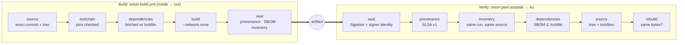

# 🧅 build-onion

**A secure build pipeline for GitHub Actions that wraps every artifact in layers of evidence — and a verifier that peels them back.**

Most supply-chain tooling answers *"is this signed?"*. build-onion answers the question you actually care about:

> Was this exact artifact built from **this commit**, by **this process**, from **these declared inputs** — and nothing else?

A build is kicked off by a manifest (`build-onion.yml`) that declares everything the build may use. The pipeline builds in layers, from the source outward, and seals each one. `onion peel` then works in reverse: starting from nothing but the artifact, it removes one layer at a time and checks that each agrees with the one beneath it, down to the source tree — and optionally rebuilds it and compares the bytes.

build-onion builds, signs, and verifies **itself** with this pipeline.



## Why it's SLSA Build Level 3

| SLSA v1.0 requirement | How build-onion meets it |
|---|---|
| Provenance exists, is authentic | Every output gets SLSA v1 provenance signed with Sigstore via GitHub artifact attestations. |
| Hosted build platform | GitHub-hosted runners only; `peel` rejects provenance with `runner_environment` other than `github-hosted`. |
| Provenance is unforgeable | Signing happens in the `seal` job, which never executes caller code. The signing identity is the **build-onion reusable workflow**, not the caller's workflow — a caller cannot mint a certificate for it. |
| Isolated builds | Each job is a fresh VM. The caller's build commands run in a job with **no `id-token` permission**, so they can't request a signing token. Outputs are re-hashed in `seal`; nothing the build job *reports* is trusted. |

And beyond L3:

- **Hermetic build step** — the build runs in the pinned builder image with `--network none`. Dependencies are fetched in a separate job and checked against the lockfile first.
- **Everything pinned** — the builder image and every `FROM` by digest, every action by commit SHA. `onion validate` fails the build otherwise.
- **Bottom-up inventory** — a signed record of the manifest, tree hash, lockfiles, every locked dependency, the builder, and every output, bound to the same run as the provenance.
- **Reproducible** — `onion peel --rebuild` replays the manifest from a clean export of the commit and compares digests. build-onion's own release job does this on every build.

## Peeling an artifact

```console
$ onion peel ghcr.io/pattercj/build-onion@sha256:… --repo PatterCJ/build-onion --commit 3f9c…
```

| Layer | What `peel` checks |
|---|---|
| **seal** | Each Sigstore bundle verifies (signature, Rekor, certificate chain); signer is the build-onion workflow; certificate's source repo/commit match the claim; provenance, SBOM, and inventory were all signed by **one** run. |
| **provenance** | SLSA v1, GitHub build type, builder is build-onion, hosted runner, source repo and commit match. |
| **inventory** | Same commit and run as provenance; the artifact is a declared output; builder pinned; build had no network; inputs are locked. |
| **dependencies** | Every Go module the SBOM found *inside the artifact* is in the lockfile — catches anything linked in that was never declared. |
| **source** *(with `--source`)* | The checkout is at the claimed commit and clean; tree hash, manifest, and lockfiles match the inventory byte-for-byte. |
| **rebuild** *(with `--rebuild`)* | Rebuilding from the manifest yields the same digest. |

Bundles come from the GitHub attestations API by default, or from a directory with `--bundles` for offline and air-gapped verification. `peel` exits non-zero unless every layer passes.

## Adopt it

1. Add a `build-onion.yml` to your repo:

   ```yaml
   apiVersion: build-onion/v1
   name: widget
   builder:
     image: docker.io/library/golang:1.27.1-bookworm@sha256:…   # digest required
   dependencies:
     lockfiles: [go.sum]
     fetch: go mod download && go mod verify    # runs WITH network
     cache: /go/pkg/mod                          # handed to the build read-only
   build:
     run: go build -o dist/widget ./cmd/widget   # runs with NO network
     env: { CGO_ENABLED: "0", GOPROXY: "off", GOFLAGS: "-trimpath -buildvcs=false" }
   outputs:
     files: [dist/widget]
     image:                                      # optional
       name: ghcr.io/acme/widget
       dockerfile: Dockerfile
   ```

2. Call the reusable workflow, pinned by commit:

   ```yaml
   jobs:
     build:
       permissions: { contents: read, id-token: write, attestations: write, packages: write }
       uses: PatterCJ/build-onion/.github/workflows/onion-build.yml@<commit-sha>
   ```

3. Verify anywhere with `onion peel` — or with the container: `docker run ghcr.io/pattercj/build-onion peel …`.

See [docs/adopting.md](docs/adopting.md) for other ecosystems and [docs/threat-model.md](docs/threat-model.md) for exactly what this does and doesn't protect against.

## The `onion` CLI

```text
onion validate   check the manifest and that every input is pinned
onion fetch      run the dependency step in the builder image (network on)
onion build      run the build step in the builder image (network off)
onion inventory  produce the bottom-up inventory predicate
onion digest     sha256 of a file, or manifest digest of an OCI archive
onion peel       verify an artifact layer by layer
```

The pipeline and `peel --rebuild` share one implementation of fetch and build, so "what the pipeline did" and "what the verifier replays" can't drift apart.

## Development

```sh
make test        # go vet + go test
make validate    # onion validate on this repo
```

The Sigstore verification tests run offline against a real GitHub Actions–signed bundle, so the cryptographic path is exercised without network access.

## License

MIT
